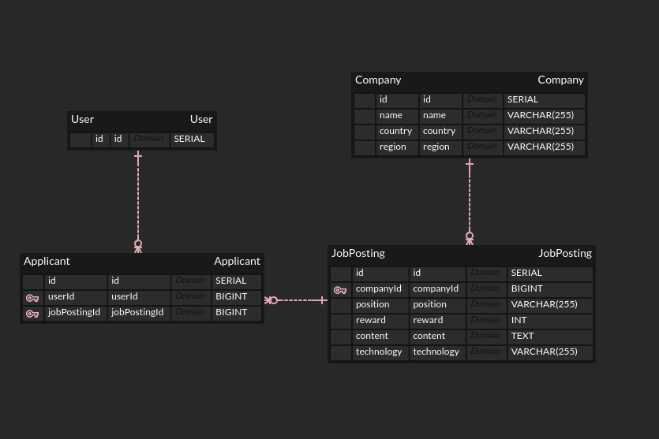

# 🚀 원티드 프리온보딩 개발과정 🚀

## 📘 API Documentation

- 👉 [Swagger Documentation](https://wante-preonboarding-backend.onrender.com/api-docs#/)

- 🚀 배포 주의사항 (클릭 후 약간의 대기 시간이 있을 수 있습니다. 콜드스타트 현상)

## 📚 기술 스택

[](https://nestjs.com/)
[](https://www.postgresql.org/)
[](https://typeorm.io/)

## 💼 NestJS: 새로운 도전

### 🌟 NestJS는?

#### 1️⃣ 모듈 시스템과 의존성 주입(DI)

- NestJS에서 가장 빛나는 부분 중 하나는 모듈 시스템과 의존성 주입(DI)입니다. 제가 사용해보았던 스프링과 유사한 개념을 가지고 있으며, 코드를 모듈로 구성하고 컴포넌트 간의 의존성을 체계적으로 관리할 수 있도록 도와줍니다. 이러한 접근 방식은 코드의 가독성을 향상시키고 재사용성을 높입니다.

#### 2️⃣ TypeScript와 정적 타입 검사

- NestJS는 TypeScript를 기반으로 하고 있어 코드의 안정성을 보장하는 데 큰 도움을 줍니다. 정적 타입 검사를 통해 런타임 오류를 사전에 방지할 수 있습니다.

#### 3️⃣ 코드 구성

- NestJS는 모듈 시스템을 통해 코드를 구성하고 각 모듈은 독립적으로 테스트 및 유지보수가 가능합니다. 이는 스프링의 모듈화 개념과 유사하며 큰 프로젝트에서 특히 유용합니다.

### 🚀 NestJS를 통한 프로젝트 구현

## 📑 요구사항 분석

- **JobPosting:** 특정 기업이 게시한 채용 정보를 담고 있습니다. 채용 포지션, 보상, 콘텐츠 및 사용 기술을 포함합니다.
- **Applicant:** 채용에 지원한 사용자의 정보를 담고 있습니다.

## 🗺️ ERD



## 🛠️ 데이터 모델 설계

### 1️⃣ `Applicant` 엔터티

`Applicant` 엔터티는 사용자(`User`)와 직무 게시물(`JobPosting`) 사이의 다대다 관계를 관리합니다.

- 🎯 **고유 제약 조건**:
  `userId`와 `jobPostingId`의 조합은 고유해야 합니다. 이를 통해 동일한 사용자가 동일한 직무 게시물에 중복으로 지원할 수 없도록 합니다.

### 2️⃣ `Company` 엔터티

`Company` 엔터티는 회사에 대한 기본 정보를 제공합니다. 여기에는 회사의 이름, 국가, 지역 정보가 포함됩니다.

- 🔄 **관계 설정**:
  `Company`와 `JobPosting`은 일대다 관계를 형성합니다. 하나의 회사는 여러 개의 직무 게시물을 가질 수 있습니다.

### 3️⃣ `JobPosting` 엔터티

`JobPosting` 엔터티는 회사의 직무 게시물을 정의합니다. 이는 포지션, 보상, 컨텐츠, 기술 등 다양한 필드를 포함합니다.

- 🔄 **관계 설정**:
  - `Company`와 `JobPosting`은 다대일 관계를 형성합니다. 하나의 직무 게시물은 하나의 회사에 속합니다.
  - `JobPosting`과 `Applicant`는 일대다 관계를 형성합니다. 하나의 직무 게시물은 여러 지원자를 가질 수 있습니다.

### 4️⃣ `User` 엔터티

`User` 엔터티는 플랫폼의 사용자를 나타냅니다.

- 🔄 **관계 설정**:
  `User`와 `Applicant`는 일대다 관계를 형성합니다. 하나의 사용자는 여러 개의 지원 상태를 가질 수 있습니다.

🔍 **이러한 설계의 핵심 포인트**:

- `Applicant` 엔터티를 통해 `User`와 `JobPosting` 간의 관계를 잘 정의하고 관리합니다.
- 모든 엔터티 간의 관계가 명확히 정의되어 있어, 데이터의 일관성을 유지하며 쿼리 효율성을 높입니다.

### 🔥 기능들:

#### 1️⃣ **채용 정보 관리**

- 생성: POST `/job-postings`
- 업데이트: PUT & PATCH `/job-postings/:id`
- 삭제: DELETE `/job-postings/:id`
- 전체 조회: GET `/job-postings`
- 상세 조회: GET `/job-postings/:id/job_posting_detail`

#### 2️⃣ **지원자 관리**

- 채용공고에 지원: POST `/applications`

#### 3️⃣ **Sample 데이터 생성**

- 기능 테스트를 위한 회사와 사용자를 생성: POST `/sample/company`, `/sample/user`

## 📂 구현 과정

### 📁 폴더 구조:

```
project-root
│
├── src
│   ├── DTO
│   ├── controllers
│   ├── models
│   └── services
├── test
└── 기타 설정 및 메타데이터 파일들
```

## 📝 API 엔드포인트 상세

### 🎉 채용 공고 관리

#### 1. 채용 공고 생성 (요구사항 1)

- **Endpoint:** `POST /job-postings`
- **Description:** 새로운 채용 공고를 등록합니다.
- **Request Body:** `JobPostingDto`
- **Response:**
  - **201 Created:** 채용 공고가 성공적으로 등록되었을 때의 응답.
  - **Body:** 생성된 `JobPostingDto`

#### 2. 채용 공고 업데이트 (요구사항 2)

- **Endpoint:** `PUT /job-postings/:id`, `PATCH /job-postings/:id`
- **Description:** 특정 채용 공고를 업데이트합니다.
- **Path Parameters:**
  - `id`: 업데이트할 채용 공고의 ID
- **Request Body:** `UpdateJobPostingDto`
- **Response:**
  - **200 OK:** 채용 공고가 성공적으로 업데이트되었을 때의 응답.
  - **Body:** 업데이트된 `UpdateJobPostingDto`

#### 3. 채용 공고 삭제 (요구사항 3)

- **Endpoint:** `DELETE /job-postings/:id`
- **Description:** 특정 채용 공고를 삭제합니다.
- **Path Parameters:**
  - `id`: 삭제할 채용 공고의 ID
- **Response:**
  - **200 OK:** 채용 공고가 성공적으로 삭제되었을 때의 응답.

#### 4. 채용 공고 목록 조회 (요구사항 4-1, 4-2 구현 완료)

- **Endpoint:** `GET /job-postings`
- **Description:** 모든 채용 공고의 목록을 조회합니다. `search` 쿼리 파라미터를 통해 채용 공고를 검색할 수 있습니다.
- **Query Parameters:**
  - `search` (optional): 채용 공고 검색 키워드, 파라미터가 없을 경우 전체 목록을 조회합니다.
- **Response:**
  - **200 OK:** 채용 공고 목록을 성공적으로 가져왔을 때의 응답.
  - **Body:** `JobPostingResponseDto[]` (채용 공고의 배열)

#### 5. 채용 공고 상세 정보 조회 (요구사항 5)

- **Endpoint:** `GET /job-postings/:id/job_posting_detail`
- **Description:** 특정 채용 공고의 상세 정보를 조회합니다.
- **Path Parameters:**
  - `id`: 조회할 채용 공고의 ID
- **Response:**
  - **200 OK:** 채용 공고 상세 정보를 성공적으로 가져왔을 때의 응답.
  - **Body:** `JobPostingDetailDto`
  - **404 Not Found:** 해당 ID의 채용 공고를 찾을 수 없을 때의 응답.

### 지원자 관리 (요구사항 6)

#### 1. 채용 공고에 지원

- **Endpoint:** `POST /applications`
- **Description:** 특정 채용 공고에 지원합니다.
- **Request Body:** `CreateApplicationDto`
- **Response:**
  - **201 Created:** 채용 공고에 성공적으로 지원했을 때의 응답.
  - **Body:** `CreateApplicationDto`
  - **409 Conflict:** 이미 채용 공고에 지원했을 경우의 응답.

## 🏁 마무리와 배운 점

- NestJS를 처음 사용하는 과정은 새로운 도전이었지만, 이러한 도전이 개발자로서 성장을 이끄는 원동력 중 하나라고 믿습니다. 스프링과 비슷한 개념을 가지고 있어서 스프링 개발자에게 친숙하게 다가올 수 있었습니다. 또한 TypeScript와 모듈 시스템을 통한 코드 구성은 코드의 가독성과 재사용성을 높여주었습니다.
